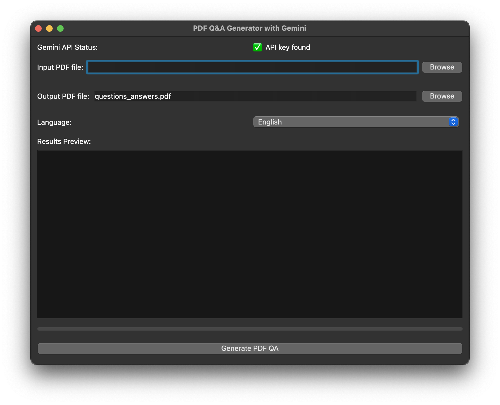

# PDF Q&A Generator with Gemini

This project uses Google Gemini's large language model to generate questions and answers from a given PDF document.  The generated Q&A pairs are then compiled into a new PDF file.

## Features

- PDF Input: Accepts PDF files as input.
- Gemini Integration: Leverages the Google Gemini API for question and answer generation.
- Multilingual Support: Supports English, Italian, French, Spanish, and German.
- Chunking: Splits large PDF text into manageable chunks for processing.
- Error Handling: Includes robust error handling and informative error messages.
- Progress Bar: Displays the progress of the PDF processing.
- Output PDF Generation: Creates a well-formatted PDF containing the generated questions and answers.
- GUI: User-friendly PyQt6 graphical user interface.


## Installation

1. Clone the repository:
   ```bash
   git clone https://github.com/leobargiotti/pdf2qa
   ```
2. Create a virtual environment (recommended):
   ```bash
   python3 -m venv venv
   source venv/bin/activate  # On Windows: venv\Scripts\activate
   ```
3. Install dependencies:
   ```bash
   pip install -r requirements.txt
   ```
4. Obtain a Gemini API key:  Sign up for Google AI and obtain an API key.
5. Set up environment variables: Create a `.env` file in the root directory of the project and add your API key:
   ```
   API_KEY=your_api_key
   GEMINI_MODEL=gemini-2.0-flash
   ```


## Usage

1. Run the application:
   ```bash
   python src/app.py
   ```
2. Browse and select your input PDF file.
3. Choose the desired output file path (optional, defaults to `questions_answers.pdf` in the same directory as the input file).
4. Select the language of the PDF from the dropdown menu.
5. Click "Generate PDF Q&A".
6. The application will process the PDF, display progress, and generate a new PDF file containing the questions and answers.


## Project Structure
- **[`src/`](./src/)**: Contains the main source code of the project.  
  - [`gemini_processor.py`](./src/gemini_processor.py) - Core logic for interacting with the Gemini API.  
  - [`app.py`](./src/app.py) - Main application file, implementing the PyQt6 GUI.  
  - [`utils.py`](./src/utils.py) - Utility functions for handling PDFs and text processing.

- **[`example/`](./example/)**: Includes example files used for testing and demonstration.  
  - [`ai_llm_intro.pdf`](./example/ai_llm_intro.pdf) - Sample input PDF containing text for processing.  
  - [`questions_answers.pdf`](./example/questions_answers.pdf) - Sample output PDF with generated Q&A content.  

- **[`images/`](./images/)**: Stores visual assets related to the project.  


## Example Usage

Input:  The [`ai_llm_intro.pdf`](./example/ai_llm_intro.pdf) file.

Output: A PDF file (e.g., [`questions_answers.pdf`](./example/questions_answers.pdf)) containing questions and answers extracted from the input PDF, formatted as shown in the example output PDF.  The exact questions and answers will vary depending on the content of the input PDF and the Gemini API's response.


## Screenshot

This is a screenshot of the application's main window.  The user can select an input PDF, specify an output file, choose a language, and initiate the Q&A generation process.


